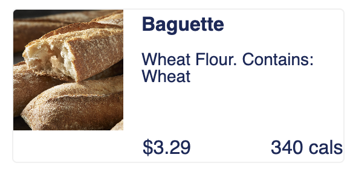

```{r setup, message = FALSE, warning = FALSE}
knitr::opts_chunk$set(
  message = FALSE, 
  warning = FALSE,
  out.width = "90%",
  set.seed(8))

library(tidyverse)
library(forecast)
library(astsa)
library(MLmetrics)
library(lubridate)
library(plotly)
library(mgcv)
library(moments)
library(modelr)
library(patchwork)
library(ggpubr)
library(ggplot2)
```

## A French Bakery’s Daily Sales in 2021-2022
Chee Kay Cheong (cc4778), Jiayi Yang (jy3186), Yishan chen (yc4016), Yuxin Liu (yl4610)
<p>&nbsp;</p >

## Data collection and cleaning
[kaggle](https://www.kaggle.com/datasets/matthieugimbert/french-bakery-daily-sales)

[price comparison](https://www.france-hotel-guide.com/en/blog/cost-baguette-paris/)
<p>&nbsp;</p >


Package used: tidyverse, forecast, astsa, MLmetrics, lubridate, plotly, mgcv, moments, modelr, patchwork, ggpubr, ggplot2
<p>&nbsp;</p >

We used updated version dataset of a French bakery from 2021-01-01 to 2022-09-30. The dataset provides the daily transaction details of customers. Since the dataset is still updating, we used downloaded version on 2022-12-03.

The dataset includes:

`date`: date order

`time`: time order

`ticket number`: identifier for every single transaction

`article`: name of the product sold (in French)

`quantity`: quantity sold

`unit_price`: price per product (in Euro)

`objective`: forecast the sales in order to ease the production planning

It contains 7 variables and 234000 observations.

<p>&nbsp;</p >
Firstly, we used `read_csv()` to import the dataset "Bakery_sales.csv", and applied `janitor::clean_names()` to change the variables' names into lower cases. Next, we tidied dataset by applying `mutate()` to remove the euro sign "€", change "," to ".", convert `unit_price` to numeric form, and renamed the `article` as `product_name`. Finally, we deleted the missing data via `filter()` and `article` via `select()`. We created an `revenue` by `unit_price` * `quantity`.
<p>&nbsp;</p >

```{r original dataset}
# Load and clean dataset:

bakery_df = 
  read_csv("./Data/Bakery_sales.csv") %>% 
  janitor::clean_names() %>% 
  mutate(
    unit_price = str_replace(unit_price, "€", ""),
    unit_price = str_replace(unit_price, ",", "."),
    unit_price = as.numeric(unit_price),
    year = year(date),
    month = month(date),
    hour = hour(time),
    product_name = article) %>% 
  filter(product_name != ".") %>% 
  select(-article)
```

<p>&nbsp;</p >
## Motivation 
It is 10:05 am in the morning, you sit in the lecture hall having your earliest lecture of the day Data Science, empty-stomached. 
A cup of coffee and a nicely warmed chocolate croissant or as French says ‘Pain Au Chocolat’ is the only thing existing in your mind… 
You wonder why the bakery items are so good and what you can do with it accompanied with the ongoing endless talking of data science 
explained by your energetic professor… Well, you jumped online and searched datasets for a French bakery and here it happens…

Bread is so much a part of French culture that even the word for “friend” comes from Latin cum pane (with bread) meaning the person 
with whom you break bread. These everyday bakery items can still be something of a mystery to people like you and me (I mean, who doesn’t 
like carbs?)

In this journey, we will take you around the analysis of a typical French bakery and find out what’s the best-seller, how much they sell, 
how is the sale distributed and so much more… 
<p>&nbsp;</p >


## Related work
We went to Paris Baguette and wanted to buy a French Baguette. However, we surprisingly found that the price exceeded our expectations ($3.29 + TAX). Since baguette is a traditional French bread, we are curious about the market of baguette in France. 

<center><center>
<p>&nbsp;</p >

As economics smoothly recover after the COVID-19 outbreak worldwide, competing forces of different retail stores grow as people return back to their normal lives. Since the demand of customers becomes volatile, we would like to use data analysis to help this French bakery identify the KPIs, boost the revenue, and expand the size of the bakery. Specifically, we would like to help the store owner to break down the specifics of how to accomplish their goals by analyzing factors influencing revenues via statistical models and hypotheses, predicting future sales via time-series forecast analyses, and looking at the top 10 popular bread out of all products.
<p>&nbsp;</p >

## Initial questions
* What products are most popular in a French bakery?
* How does this French bakery market perform year by year?
* Is there any difference in the mean price of baguette in this French bakery comparing to the average price in France?
* Since our data ends at 2022-09-30, how would the sales trend look like for the remaining of 2022?
* Which month in a year/time in a day has the highest sales?
<p>&nbsp;</p >


## Descriptions of approaches

In Exploratory Analyses, we focused on product count, unit price, revenue, and time trend by using pie, doughnut, bar, line, and scatter plots. We mainly analyzed the top 10 favorite bakery products to increase annual sales and profit, hit revenue targets, and gain more clients.

In Statistical Analyses, we will perform several statistical analysis in this bakery including ANOVA to check the mean difference of peak sale months between 2021 and 2022, One-Sample t-test to check the mean price of baguette with average price in the nation, simple linear regression to test the linear relationship between quantity of sale and hours in the day, and finally multiple linear regression. 

In Forecast Analyses, we will be testing four forecast models and identify the best model to help us predict the daily sale for this French bakery. 
<p>&nbsp;</p >


## Exploratory analyses
<p>&nbsp;</p >

### 24hr Time trends
```{r}
bakery_df = 
  bakery_df %>% 
  mutate(
    Hour = hour(time),
    Month = month(date))

bakery_df %>% 
  group_by(Hour) %>% 
  count() %>% 
  ggplot(aes(x = Hour, y = n)) +
  geom_point() +
  geom_line() +
  geom_text(aes(label=n), vjust = 0, nudge_y = 0.2) +
  scale_x_continuous(breaks = seq(7, 20), limit = c(7, 20)) +
  scale_y_continuous(limit = c(0,50000)) +
  labs(title = "Peak hours",
       x = "Hour (24-hour format)",
       y = "Total number of transactions")
```

The line plot shows the bakery is open at 7 AM and closed at 20 PM. The total number of transactions increase dramatically once the bakery is open from 7 AM to 11 AM and from 15 PM to 17 PM. It reaches peak at 11 AM (47116). In addition, the total number of transactions starts decreasing steeply from 11 AM to 15 PM and from 17 PM to 20 PM. Therefore, there are two rush hours as we expected, since people usually eat breads as breakfast, brunch, and afternoon tea dessert. 

<p>&nbsp;</p >
### Top 10 favorite bakery products
```{r}
plot_pie =
  bakery_df %>% 
  group_by(product_name) %>% 
  summarize(n_obs = n()) %>% 
  arrange(desc(n_obs)) %>% 
  head(10) %>% 
  plot_ly(labels = ~product_name, values = ~n_obs, type = 'pie', colors = "viridis") %>% 
  layout(xaxis = list(showgrid = FALSE, zeroline = FALSE, showticklabels = FALSE),
         yaxis = list(showgrid = FALSE, zeroline = FALSE, showticklabels = FALSE))

plot_pie
```

The pie chart shows the total of sale counts of top 10 favorite bakery products from 2021-01-01 to 2022-09-30. As the plot shows that the `TRADITIONAL BAGUETTE` (67,689; 42.5%) is the most favorite bakery product. The rest ranking from top 2 to top 10 favorite bakeries are  `COUPE` (20,470; 12.90%), `BAGUETTE` (15,292; 9.61%) `BANETTE` (15,130; 9.51%), `CROISSANT` (11,508; 7.23%), `PAIN AU CHOCOLAT` (10,578; 6.65%), `SPECIAL BREAD` (5195; 3.26%), `CEREAL BAGUETTE` (4961; 3.12%), `FORMULE SANDWITCH` (4202; 2.64%), and `BOULE 400G` (4099; 2.58%), respectively. 

<p>&nbsp;</p >
### Top 10 favorite bakery products in 2021/2022
```{r}
plot_pie =
  bakery_df %>% 
  separate(date, into = c("year", "month", "day"), sep = "-") %>% 
  mutate(year = as.numeric(year),
         month = as.integer(month),
         day = as.integer(day),) 
  
plot_pie_2021 = 
  plot_pie %>% 
  filter(year == 2021) %>%
  group_by(product_name) %>% 
  summarize(n_obs = n()) %>% 
  arrange(desc(n_obs)) %>% 
  head(10) %>% 
  plot_ly(labels = ~product_name, values = ~n_obs) %>% 
  add_pie(hole = 0.6) %>% 
  layout(title = 'Top 10 favorite bakery products in 2021',
         xaxis = list(showgrid = FALSE, zeroline = FALSE, showticklabels = FALSE),
         yaxis = list(showgrid = FALSE, zeroline = FALSE, showticklabels = FALSE))

plot_pie_2022 = 
  plot_pie %>% 
  filter(year == 2022) %>%
  group_by(product_name) %>% 
  summarize(n_obs = n()) %>% 
  arrange(desc(n_obs)) %>% 
  head(10) %>% 
  plot_ly(labels = ~product_name, values = ~n_obs) %>% 
  add_pie(hole = 0.6) %>% 
  layout(title = 'Top 10 favorite bakery products in 2022',
         xaxis = list(showgrid = FALSE, zeroline = FALSE, showticklabels = FALSE),
         yaxis = list(showgrid = FALSE, zeroline = FALSE, showticklabels = FALSE))

plot_pie_2021
plot_pie_2022
```

The first doughnut chart shows the total of sale counts of top 10 favorite bakery products from 2021-01-01 to 2021-12-31. As the plot shows that the `TRADITIONAL BAGUETTE` (37,399; 42%) is the most favorite bakery . The rest ranking from top 2 to top 10 favorite bakeries are  `COUPE` (11,759; 13.2%), `BAGUETTE` (8713; 9.78%) `BANETTE` (8575; 9.63%), `CROISSANT` (6291; 7.06%), `PAIN AU CHOCOLAT` (5739; 6.44%), `CEREAL BAGUETTE` (3070; 3.45%), `SPECIAL BREAD` (2936; 3.3%), `CAMPAGNE` (2289; 2.57%), and `BOULE 400G` (2283; 2.56%), respectively. 

The second doughnut chart shows the total of sale counts of top 10 favorite bakery products from 2022-01-01 to 2022-09-30. As the plot shows that the `TRADITIONAL BAGUETTE` (30,290; 43.2%) is the most favorite bakery . The rest ranking from top 2 to top 10 favorite bakeries are  `COUPE` (8711; 12.4%), `BAGUETTE` (6579; 9.38%) `BANETTE` (6555; 9.35%), `CROISSANT` (5217; 7.44%), `PAIN AU CHOCOLAT` (4839; 6.9%), `SPECIAL BREAD` (2259; 3.22%), `FORMULE SANDWITCH` (1976; 2.82%), `CEREAL BAGUETTE` (1891; 2.7%), and `BOULE 400G` (1816; 2.59%), respectively. 

Compared donut charts of 2021 and 2022, the ranking of top 1-6 favorite bakeries does not change. `CAMPAGNE` dropped out of the top 10 list, and `FORMULE SANDWITCH` was added the top 10 favorite bakery products in 2022. Top 7-9 moved slightly from 2021 to 2022. Top 10 `BOULE 400G` stayed in the same position. 

<p>&nbsp;</p >
### Top 10 favorite bread monthly sale counts in 2021
```{r}
top_line =
  bakery_df %>% 
  separate(date, into = c("year", "month", "day"), sep = "-") %>% 
  mutate(year = as.numeric(year),
         month = as.integer(month),
         day = as.integer(day),) %>%
  filter(year == 2021) %>% 
  select (year, month, product_name, quantity) %>% 
  group_by (year, month, product_name) %>% 
  mutate (total_counts = sum (quantity)) %>% 
  distinct(year, month, product_name,total_counts) 

top_line1_2021 =
  top_line %>% 
  filter(product_name %in% c("TRADITIONAL BAGUETTE")) %>% 
  ggplot(aes(x =month, y = total_counts, color = product_name)) + 
    geom_line() +
    theme(axis.text.x = element_text(angle=90,hjust = 1), legend.position = "none") +
    labs(x = "month",
         y = "counts of TRADITIONAL BAGUETTE",
         title = "Top 1") +
    scale_x_continuous(
    breaks = c(1, 2, 3, 4, 5, 6, 7, 8, 9, 10, 11, 12), 
    labels = c("Jan","Feb","Mar","Apr","May", "Jun", "Jul", "Aug", "Sep", "Oct", "Nov", "Dec")) 

top_line2_2021 =
  top_line %>% 
    filter(product_name %in% c("COUPE", "BAGUETTE","BANETTE", "CROISSANT", "PAIN AU CHOCOLAT", "CEREAL BAGUETTE", "SPECIAL BREAD", "CAMPAGNE", "BOULE 400G")) %>% 
  ggplot(aes(x =month, y = total_counts, color = product_name)) + 
    geom_line() +
    theme(axis.text.x = element_text(angle=90,hjust = 1), legend.position = "none", legend.title = element_text(size=7), legend.text = element_text(size=7)) + 
    labs(x = "month",
         y = "counts of bread",
         title = "Top 2-10") +
    scale_x_continuous(
    breaks = c(1, 2, 3, 4, 5, 6, 7, 8, 9, 10, 11, 12), 
    labels = c("Jan","Feb","Mar","Apr","May", "Jun", "Jul", "Aug", "Sep", "Oct", "Nov", "Dec"))

ggarrange(top_line2_2021, top_line1_2021, ncol=2, nrow=1, common.legend = TRUE, legend="bottom")
```

In general, monthly sale counts in 2021 increased dramatically from June to August.

For `TRADITIONAL BAGUETTE` (line plot on the right), total monthly sale counts in 2021 peaked at August (>11,250). However, total monthly sale counts decreased from May to June, August to September, and October to December in 2021. 

For line plot on the left, total monthly sale counts in 2021 are less than 3,000 but greater than 500 in every month for top 2-6 (`COUPE`, `BAGUETTE`, `BANETTE`, `CROISSANT`, `PAIN AU CHOCOLAT`). For top 7-10 (`CEREAL BAGUETTE`, `SPECIAL BREAD`, `CAMPAGNE`, and `BOULE 400G`), total monthly sale counts in 2021 are less than 1,000. 

<p>&nbsp;</p >
### Top 10 favorite bread monthly sale counts in 2022
```{r}
top_line =
  bakery_df %>% 
  separate(date, into = c("year", "month", "day"), sep = "-") %>% 
  mutate(year = as.numeric(year),
         month = as.integer(month),
         day = as.integer(day),) %>%
  filter(year == 2022) %>% 
  select (year, month, product_name, quantity) %>% 
  group_by (year, month, product_name) %>% 
  mutate (total_counts = sum (quantity)) %>% 
  distinct(year, month, product_name,total_counts) 

top_line1_2022 =
  top_line %>% 
  filter(product_name %in% c("TRADITIONAL BAGUETTE")) %>% 
  ggplot(aes(x =month, y = total_counts, color = product_name)) + 
    geom_line() +
    theme(legend.position = "none", axis.text.x = element_text(angle=90,hjust = 1)) + 
    labs(x = "month",
         y = "counts of TRADITIONAL BAGUETTE",
         title = "Top 1") +
    scale_x_continuous(
    breaks = c(1, 2, 3, 4, 5, 6, 7, 8, 9, 10, 11, 12), 
    labels = c("Jan","Feb","Mar","Apr","May", "Jun", "Jul", "Aug", "Sep", "Oct", "Nov", "Dec")) 

top_line2_2022 =
  top_line %>% 
    filter(product_name %in% c("COUPE", "BAGUETTE","BANETTE", "CROISSANT", "PAIN AU CHOCOLAT", "SPECIAL BREAD", "FORMULE SANDWICH","CEREAL BAGUETTE", "BOULE 400G")) %>% 
  ggplot(aes(x =month, y = total_counts, color = product_name)) + 
    geom_line() +
    theme(axis.text.x = element_text(angle=90,hjust = 1), legend.position = "none", legend.title = element_text(size=7), legend.text = element_text(size=7)) + 
    labs(x = "month",
         y = "counts of bread",
         title = "Top 2-10") +
    scale_x_continuous(
    breaks = c(1, 2, 3, 4, 5, 6, 7, 8, 9, 10, 11, 12), 
    labels = c("Jan","Feb","Mar","Apr","May", "Jun", "Jul", "Aug", "Sep", "Oct", "Nov", "Dec")) 
 
ggarrange(top_line2_2022, top_line1_2022, ncol=2, nrow=1, common.legend = TRUE, legend="bottom")

```

In general, monthly sale counts in 2022 show similar trend as in 2021, but monthly sale counts end at 2022-09-30 due to limited data. 

For `TRADITIONAL BAGUETTE` (line plot on the right), total monthly sale counts in 2022 peaked at August (>12,500). However, total monthly sale counts decreased from May to June and August to September in 2022. Compared to 2021 (>11,250), total monthly sale counts of `TRADITIONAL BAGUETTE` is higher in 2022 (>12,500). 

For line plot on the left, total monthly sale counts in 2022 are less than 3,500 but greater than 500 in every month for top 2-6 (`COUPE`, `BAGUETTE`, `BANETTE`, `CROISSANT`, `PAIN AU CHOCOLAT`). For top 7-10 (`SPECIAL BREAD`, `FORMULE SANDWICH`, `CEREAL BAGUETTE`, and `BOULE 400G`), total monthly sale counts in 2022 are less than 600. 

<p>&nbsp;</p >
### Ranking of mean prices of top 10 products in 2021
```{r}
mean_price_2021 =
  bakery_df %>% 
  separate(date, into = c("year", "month", "day"), sep = "-") %>% 
  mutate(year = as.numeric(year),
         month = as.integer(month),
         day = as.integer(day)) %>%
  filter(year == 2021) %>% 
  filter(product_name %in% c("TRADITIONAL BAGUETTE", "COUPE", "BAGUETTE","BANETTE", "CROISSANT", "PAIN AU CHOCOLAT", "CEREAL BAGUETTE", "SPECIAL BREAD", "CAMPAGNE", "BOULE 400G")) %>% 
  group_by(product_name) %>% 
  summarize(mean_price = mean(unit_price)) %>% 
  arrange(desc(mean_price)) %>% 
  mutate(product_name = forcats::fct_relevel(product_name, c("TRADITIONAL BAGUETTE", "COUPE", "BAGUETTE","BANETTE", "CROISSANT", "PAIN AU CHOCOLAT", "CEREAL BAGUETTE", "SPECIAL BREAD", "CAMPAGNE", "BOULE 400G"))) %>% 
  ggplot(aes(x =product_name, y = mean_price, color = product_name)) + 
      geom_point() +
      geom_text(aes(label=mean_price), vjust = 0, nudge_y = 0.1) +
      ylim(0,3) +
    theme(axis.text.x = element_text(angle=60,hjust = 1), legend.position = "none") + 
    labs(x = "name of products",
         y = "mean prices in euro") 
  
mean_price_2021 
```

The scatter plot shows the ranking of mean prices of top 10 favorite bakery products in 2021, with most popularity to least popularity (top1-10) from the left to the right on x-axis.

`SPECIAL BREAD` has the highest mean price (2.4 €) while `COUPE` has the lowest mean price (0.15 €). The mean prices of `TRADITIONAL BAGUETTE` and 
`PAIN AU CHOCOLAT` are the same (1.2 €).

<p>&nbsp;</p >
### Ranking of mean prices of top 10 products in 2022
```{r, warning=FALSE}
mean_price_2022 =
  bakery_df %>% 
  separate(date, into = c("year", "month", "day"), sep = "-") %>% 
  mutate(year = as.numeric(year),
         month = as.integer(month),
         day = as.integer(day)) %>%
  filter(year == 2022) %>% 
  filter(product_name %in% c("TRADITIONAL BAGUETTE", "COUPE", "BAGUETTE","BANETTE", "CROISSANT", "PAIN AU CHOCOLAT", "SPECIAL BREAD", "FORMULE SANDWICH","CEREAL BAGUETTE", "BOULE 400G")) %>% 
  group_by(product_name) %>% 
  summarize(mean_price = mean(unit_price)) %>%
  mutate(across(where(is.numeric), ~ round(., digits = 2))) %>% 
  arrange(desc(mean_price)) %>% 
  mutate(product_name = forcats::fct_relevel(product_name, c("TRADITIONAL BAGUETTE", "COUPE", "BAGUETTE","BANETTE", "CROISSANT", "PAIN AU CHOCOLAT", "SPECIAL BREAD", "FORMULE SANDWICH","CEREAL BAGUETTE", "BOULE 400G"))) %>% 
  ggplot(aes(x =product_name, y = mean_price, color = product_name)) + 
      geom_point() +
      geom_text(aes(label=mean_price), vjust = 0, nudge_y = 0.2) +
      ylim(0,7.5) +
    theme(axis.text.x = element_text(angle=60,hjust = 1), legend.position = "none") + 
    labs(x = "name of products",
         y = "mean prices in euro") 
  
mean_price_2022 
```

The scatter plot shows the ranking of mean prices of top 10 favorite bakery products in 2022, with most popularity to least popularity (top1-10) from the left to the right on x-axis. In general, the mean price of `COUPE` stayed the same from 2021 to 2022, but mean prices of other breads increased slightly.

`FORMULE SANDWICH` has the highest mean price (6.94 €) while `COUPE` has the lowest mean price (0.15 €). The mean prices of `TRADITIONAL BAGUETTE` and 
`PAIN AU CHOCOLAT` are the same (1.27 €)., but both increased from 1.2 € to 1.27 € when compared to the scatter plot in 2021. 

<p>&nbsp;</p >
### Ranking of total revenue of top 10 products in 2021 and 2022
```{r}
total_rev_bar=
  bakery_df %>% 
  separate(date, into = c("year", "month", "day"), sep = "-") %>% 
  mutate(year = as.numeric(year),
         month = as.integer(month),
         day = as.integer(day)) %>%
  group_by(year, product_name) %>% 
  mutate(rev = quantity * unit_price) %>% 
  summarize(prod_rev = sum(rev)) %>% 
  arrange(desc(prod_rev)) 
  
total_rev_bar_2021=
  total_rev_bar %>% 
  filter(year == 2021) %>% 
  filter(product_name %in% c("TRADITIONAL BAGUETTE", "COUPE", "BAGUETTE","BANETTE", "CROISSANT", "PAIN AU CHOCOLAT", "CEREAL BAGUETTE", "SPECIAL BREAD", "CAMPAGNE", "BOULE 400G")) %>% 
  mutate(product_name = fct_reorder(product_name, prod_rev)) %>% 
  mutate(across(where(is.numeric), ~ round(., digits = 2))) %>% 
  ggplot(aes(x =product_name, y= prod_rev, fill=product_name)) + 
    geom_bar(stat="identity", width=0.5) +
    geom_text(aes(label=prod_rev), vjust = 0, nudge_y = 100, size=3) +
    ylim(0,80000) +
    labs(x = "name of products",
         y = "total revenue in euro",
         title = "ranking in 2021") +
  theme(axis.text.x = element_text(angle = 15, hjust = 1), legend.position = "none")
  
total_rev_bar_2022=
  total_rev_bar %>% 
  filter(year == 2022) %>% 
  filter(product_name %in% c("TRADITIONAL BAGUETTE", "COUPE", "BAGUETTE","BANETTE", "CROISSANT", "PAIN AU CHOCOLAT", "SPECIAL BREAD", "FORMULE SANDWICH","CEREAL BAGUETTE", "BOULE 400G")) %>% 
  mutate(product_name = fct_reorder(product_name, prod_rev)) %>%
  mutate(across(where(is.numeric), ~ round(., digits = 2))) %>% 
  ggplot(aes(x =product_name, y= prod_rev, fill=product_name)) + 
    geom_bar(stat="identity", width=0.5) +
    geom_text(aes(label=prod_rev), vjust = 0, nudge_y = 100, size=3) +
    ylim(0,80000) +
    labs(x = "name of products",
         y = "total revenue in euro",
         title = "ranking in 2022") +
  theme(axis.text.x = element_text(angle = 15, hjust = 1), legend.position = "none")
 
ggarrange(total_rev_bar_2021, total_rev_bar_2022,  heights = c(5, 5),
          ncol = 1, nrow = 2)
```

The bar chart shows the ranking of total revenue of top 10 products in 2021 and 2022. The total revenues of `TRADITIONAL BAGUETTE` are the highest (78742.8 € in 2021; 66013.25 € in 2022) while the total revenues of `COUPE` are the lowest (2049.9 € in 2021; 1475.85 € in 2022) in the two years respectively. The total revenues of `TRADITIONAL BAGUETTE` is approximately 38 times the total revenues of `COUPE` in 2021 and 45 times of that in 2022.

<p>&nbsp;</p >
### Distribution of monthly revenue in 2021 and 2022
```{r}
dis_rev_bar=
  bakery_df %>% 
  separate(date, into = c("year", "month", "day"), sep = "-") %>% 
  mutate(year = as.numeric(year),
         month = as.integer(month),
         day = as.integer(day),) 

dis_rev_bar_2021=
  dis_rev_bar %>%
    filter(year == 2021,
         product_name %in% c("TRADITIONAL BAGUETTE", "COUPE", "BAGUETTE","BANETTE", "CROISSANT", "PAIN AU CHOCOLAT", "CEREAL BAGUETTE", "SPECIAL BREAD", "CAMPAGNE", "BOULE 400G")) %>% 
  group_by(year, month, product_name) %>% 
  mutate(rev = quantity * unit_price) %>% 
  summarize(prod_dis_rev = sum(rev)) %>% 
  arrange(desc(prod_dis_rev)) %>% 
   mutate(product_name = fct_reorder(product_name, prod_dis_rev)) %>% 
    ggplot(aes(x =month, y= prod_dis_rev, fill=product_name)) + 
    scale_fill_viridis_d()+
    geom_bar(stat="identity", position="stack") +
    labs(x = "month",
         y = "total revenue in euro",
         title = "Distribution of monthly revenue in 2021") +
  theme(axis.text.x = element_text(angle = 45, hjust = 1), legend.position = "right", legend.title = element_text(size=7), legend.text = element_text(size=7), legend.key.size = unit(0.2, 'cm')) +
  scale_x_continuous(
    breaks = c(1, 2, 3, 4, 5, 6, 7, 8, 9, 10, 11, 12), 
    labels = c("Jan","Feb","Mar","Apr","May", "Jun", "Jul", "Aug", "Sep", "Oct", "Nov", "Dec")) 

dis_rev_bar_2022=
  dis_rev_bar %>%
    filter(year == 2022,
         product_name %in% c("TRADITIONAL BAGUETTE", "COUPE", "BAGUETTE","BANETTE", "CROISSANT", "PAIN AU CHOCOLAT", "SPECIAL BREAD", "FORMULE SANDWICH","CEREAL BAGUETTE", "BOULE 400G")) %>% 
  group_by(year, month, product_name) %>% 
  mutate(rev = quantity * unit_price) %>% 
  summarize(prod_dis_rev = sum(rev)) %>% 
  arrange(desc(prod_dis_rev)) %>% 
   mutate(product_name = fct_reorder(product_name, prod_dis_rev)) %>% 
    ggplot(aes(x =month, y= prod_dis_rev, fill=product_name)) + 
    scale_fill_viridis_d()+
    geom_bar(stat="identity", position="stack") +
    labs(x = "month",
         y = "total revenue in euro",
         title = "Distribution of monthly revenue in 2022") +
  theme(axis.text.x = element_text(angle = 45, hjust = 1), legend.position = "right",legend.title = element_text(size=7), legend.text = element_text(size=7), legend.key.size = unit(0.2, 'cm')) +
  scale_x_continuous(
    breaks = c(1, 2, 3, 4, 5, 6, 7, 8, 9, 10, 11, 12), 
    labels = c("Jan","Feb","Mar","Apr","May", "Jun", "Jul", "Aug", "Sep", "Oct", "Nov", "Dec")) 

ggarrange(dis_rev_bar_2021, dis_rev_bar_2022,  heights = c(5, 5),
          ncol = 1, nrow = 2)
```

The bar plots show distributions of monthly revenue in 2021 and 2022. `TRADITIONAL BAGUETTE` has the largest proportion of monthly revenues (around 50%) in 2021 and 2022. Moreover, the revenue trend from Jan to Dec is similar in 2021 and 2022. Since the bakery sold more products in summer than winter, and reached peak in August, we could expect higher revenue in summer than winter, and the highest revenue in August.
<p>&nbsp;</p >


## Discussion of results
<p>&nbsp;</p >
### ANOVA
```{r, warning = FALSE, message=FALSE}
# Data input and cleaning 
bakery_df =
  read_csv("./Data/Bakery_sales.csv") %>% 
  janitor::clean_names() %>% 
  mutate(
    unit_price = str_replace(unit_price, "€", ""),
    unit_price = str_replace(unit_price, ",", "."),
    unit_price = as.numeric(unit_price),
    product_name = article, 
    rev = quantity * unit_price
    ) %>% 
  filter(product_name != ".") %>% 
  select(-article)

```
ANOVA tests whether there is a difference in means of the groups at each level (each individual month) of the independent variable of peak months (Jun - Sep).

One way anova test can test if the mean sales of peak months (Jun - Sep) in 2021 is different from the mean sales of peak months (Jun - Sep) in 2022.

Our data contains 7 variables and 234000 observations, and we can assume the large sample size being normally distributed by central limit theorem. (The central limit theorem (CLT) states that the distribution of sample means approximates a normal distribution as the sample size gets larger(n>30), regardless of the population's distribution.) 

The null hypothesis is that there is no difference in the mean sales of peak months in 2021 and 2022.                                        
The alternative hypothesis is that the means are different from one another.

```{r ANOVA, warning = FALSE, message = FALSE}
anova_df =
  bakery_df %>% 
  mutate(
    year = year(date),
    month = month(date)
    ) 
  

one_sales = 
  anova_df %>% 
  filter((month == 6)|(month == 7)|(month == 8)|(month == 9)) %>% 
  filter(year == 2021) %>% 
  group_by(year, month) %>% 
  summarize(one_sales = n()) %>% 
  group_by(year, month) %>% 
  mutate(ID = cur_group_id())
  
two_sales = 
  anova_df %>% 
  filter((month == 6)|(month == 7)|(month == 8)|(month == 9)) %>% 
  filter(year == 2022) %>% 
  group_by(year, month) %>% 
  summarize(two_sales = n()) %>% 
  group_by(year, month) %>% 
  mutate(ID = cur_group_id())
  
anova_test_df = 
  left_join(one_sales, two_sales, by = c("ID"))


one.way <- aov(one_sales ~ two_sales, data = anova_test_df) %>% 
  broom::tidy() %>% 
  knitr::kable(digits = 2) 

one.way
```
The ANOVA test p-value is 0.01 which is less than alpha level of 0.05, so we reject the null hypothesis and conclude that the mean sales of peak months in 2021 is statistically significantly different from the mean sales of peak months in 2022. According to the Exploratory Analysis graphs, 2022 has increased the overall sales compared to 2021. This might due to the reasons of COVID-19 pandemic during 2021 and a better recovery with less restricted rules in 2022, which makes a significant difference in same period of the two years.
 
<p>&nbsp;</p >
### One Sample T-test
We are interested in testing if the mean price of `BAGUETTE` in this bakery is significantly different from the average price for a baguette in Paris, which is 1.07 euros. 


Null hypothesis: The mean price of baguette in this bakery is the same as the average price of baguette in Paris.

Alternative hypothesis: The mean price of baguette in this bakery is different from the average price of baguette in Paris.

Our population follows a Poisson distribution as shown below, and we can assume the large sample size being normally distributed by central limit theorem. 

```{r, warning = FALSE, message = FALSE}
bakery_df %>% 
  filter(product_name == "TRADITIONAL BAGUETTE") %>% 
  group_by(date) %>% 
  summarize(total_sale = sum(quantity)) %>% 
  ggplot(aes(x = total_sale)) +
  geom_histogram() +
  labs(
    x = "Total sale quantity per day", 
    y = "Count",
    title = "Distribution of sale quantity") +
  theme(
    axis.text = element_text(size = 12),
    axis.title = element_text(size = 14, face = "bold"),
    plot.title = element_text(hjust = 0.4, face = "bold"))

baguette_onet = 
  bakery_df %>% 
  filter(product_name == "BAGUETTE") %>%
  select(unit_price)

baguette_t_results = 
  t.test(baguette_onet, mu = 1.07 , alternative = "two.sided") %>% 
  broom::tidy() 

baguette_t_results %>% 
  knitr::kable(digits = 4)
```

The p-value is much smaller than the alpha (0.05), so we would reject the null hypothesis. At 5% level of significance, we have sufficient 
evidence to conclude that the mean price of baguette in this bakery is significantly different from the average price of baguette in Paris.

<p>&nbsp;</p >
### Traditional Baguette (One-sided)

We noticed that the price of traditional baguette in this bakery is higher than the average price of traditional baguette in France. The
price of the traditional French loaf is around 0.90 Euros in bakeries. Therefore, we would like to conduct a one-sided T-test to see if the price difference is significant. 

Null hypothesis: The mean price of traditional baguette in this bakery is the same as the average price of traditional baguette in France.

Alternative hypothesis: The mean price of traditional baguette in this bakery is higher than the average price of traditional baguette in
France.

```{r, warning = FALSE}
bakery_df %>% 
  filter(product_name == "TRADITIONAL BAGUETTE") %>% 
  count(unit_price) %>% 
   knitr::kable(digits = 4)
  
trad_baguette_onet = 
  bakery_df %>% 
  filter(product_name == "TRADITIONAL BAGUETTE") %>%
  select(unit_price)

trad_baguette_t_results = 
  t.test(trad_baguette_onet, mu = 0.90, alternative = "greater") %>% 
  broom::tidy() 

trad_baguette_t_results %>% 
   knitr::kable(digits = 4)
```

The p-value is much smaller than the alpha (0.05), so we would reject the null hypothesis. At 5% level of significance, we have sufficient 
evidence to conclude that the mean price of traditional baguette in this bakery is significantly higher than the average price of baguette in Paris.

<p>&nbsp;</p >
### Simple Linear Regression 
We conduct a simple linear regression for `CROISSANT`'s sale counts and when it's being sold (hour of the day) and test the model using `Cross Validation`.


The plot below shows the average amount of products sold in each hour during the business hour.
```{r, warning = FALSE}
bakery_df = 
  bakery_df %>% 
  mutate(
    Hour = hour(time),
    Month = month(date))

bakery_df %>% 
  group_by(Hour) %>% 
  count() %>%
  mutate(
    average_count = n / 600) %>% 
  ggplot(aes(x = Hour, y = average_count)) +
  geom_point() +
  geom_line() +
  scale_x_continuous(breaks = seq(7, 20), limit = c(7, 20)) +
  scale_y_continuous(limit = c(0, 80)) +
  labs(
    title = "Average amount of products sold in every hour per day",
    x = "Hour (24-hour format)",
    y = "Number of products sold") +
  theme(
    axis.text = element_text(size = 12),
    axis.title = element_text(size = 14, face = "bold"),
    plot.title = element_text(hjust = 0.4, face = "bold"))
``` 

From the graph above, it seems like there is a linear trend from 7 AM to 11 AM. Hence, we should take a look at the morning hours with a monotonic function from 7 AM to 11 AM.
```{r, warning = FALSE}
bakery_df %>% 
  mutate(year = year(date)) %>% 
  filter(year == 2021) %>% 
  group_by(Hour) %>% 
  summarize(
    n_sold = sum(quantity) / 365) %>% 
  ggplot(aes(x = Hour, y = n_sold)) +
  geom_point() +
  geom_line() +
  scale_x_continuous(breaks = seq(7, 11), limit = c(7, 11)) +
  scale_y_continuous(limit = c(0, 120)) +
  labs(
    title = "Average amount of products sold from 7am - 11am",
    x = "Hour (24-hour format)",
    y = "Number of products sold") +
  theme(
    axis.text = element_text(size = 12),
    axis.title = element_text(size = 14, face = "bold"),
    plot.title = element_text(hjust = 0.4, face = "bold"))
```

It looks like a monotonic linear relationship that we can take a further look at using simple linear regression model.

```{r, warning = FALSE}
slr_df = 
  bakery_df  %>% 
  mutate(
    hour_cp = (Hour > 8) * (Hour - 8))

slr_reg = lm(quantity ~ Hour, slr_df)

slr_reg %>% 
  broom::tidy() %>% 
  knitr::kable(digits = 2) 
```
The model is 
Sale count = 1.99 - 0.04 * Hour

<p>&nbsp;</p >
#### Cross validation 
```{r, warning = FALSE}
# created 3 models: linear, piecewise, and smooth models 
linear_mod = lm(quantity ~ Hour, slr_df)
pwl_mod    = lm(quantity ~ Hour + hour_cp, data = slr_df)
smooth_mod = gam(quantity ~ s(Hour), data = slr_df)
```

```{r, warning = FALSE}
slr_df %>% 
  gather_predictions(linear_mod, pwl_mod, smooth_mod) %>% 
  mutate(model = fct_inorder(model)) %>% 
  ggplot(aes(x = Hour, y = quantity)) + 
  geom_point(alpha = .5, size = 0.05) +
  geom_line(aes(y = pred), color = "red") +
  ylim(1, 2) +
  facet_grid(~model)
```

The three models with original scales are very similar. Therefore, when we visualize the three models, we change the y-axis scale to 0-3 as a zoom-in function in order to see the nuance differences between each model. 


Re-sample the dataset by `crossv_mc` and let's see the rmse of each model and make a table
```{r, warning = FALSE}
# created a train model and test model; check rmse 
set.seed(2022)
cv_df =
  crossv_mc(slr_df, 100) %>% 
  mutate(
    train = map(train, as_tibble),
    test = map(test, as_tibble))

cv_df = 
  cv_df %>% 
  mutate(
    linear_mod  = map(train, ~lm(quantity ~ Hour, data = .x)),
    pwl_mod     = map(train, ~lm(quantity ~ Hour + hour_cp, data = .x)),
    smooth_mod  = map(train, ~gam(quantity ~ s(Hour), data = as_tibble(.x)))) %>% 
  mutate(
    rmse_linear = map2_dbl(linear_mod, test, ~rmse(model = .x, data = .y)),
    rmse_pwl    = map2_dbl(pwl_mod, test, ~rmse(model = .x, data = .y)),
    rmse_smooth = map2_dbl(smooth_mod, test, ~rmse(model = .x, data = .y))) 

  cv_df %>% 
  select(rmse_linear, rmse_pwl, rmse_smooth) %>% 
  pivot_longer(
    everything(),
    names_to = "model", 
    values_to = "rmse",
    names_prefix = "rmse_") %>% 
  group_by(model) %>% 
  summarize(mean(rmse)) %>% 
  mutate(mean_rmse = `mean(rmse)`) %>% 
  select(-`mean(rmse)`) %>% 
  knitr::kable(digits = 4)
```
Then plot the rmse graph
```{r, warning = FALSE}
cv_df %>% 
  select(starts_with("rmse")) %>% 
  pivot_longer(
    everything(),
    names_to = "model", 
    values_to = "rmse",
    names_prefix = "rmse_") %>% 
  mutate(model = fct_inorder(model)) %>% 
  ggplot(aes(x = model, y = rmse)) + geom_violin()
```


From the visualization graphs of three rmse models, it is hard to determine the slightly change of each model, but from our mean rmse table we conclude that the smooth model is the best out of the three with the least mean rmse (1.2688).

Based on the results, there is a slightly improvement using smooth model as it has the lowest rmse, we can conclude that the smooth model is to be accounted for this relationship in the product of croissant.

<p>&nbsp;</p >
### Multiple Linear Regression

We are interested in testing the relationship between the revenue (outcome variable) and 2 main predictors, which are unit price of a product and its quantity being sold. Considering that the sales of bakery varies by month, we included `month` in our model as a confounder to be controlled.


<p>&nbsp;</p>

Multivariable linear regression model 
```{r, warning = FALSE}
baguette_df = 
  bakery_df %>% 
  filter(str_detect(product_name, "BAGUETTE")) %>% 
  mutate(
    month = month(date)
  )
baguette_reg = lm(rev ~ unit_price + quantity + month, baguette_df)


baguette_reg %>% 
  broom::tidy() %>% 
  knitr::kable(digits = 4)
```

Examine assumptions for the chosen Linear Regression model

```{r, warning = FALSE}
par(mfrow = c(2, 2))
plot(baguette_reg)
```

According to the assumption check graph, the normal qq plot is approximately closed to the predicted line with residuals on both sides, but the residual plots might violate some of the linear regression assumptions (homoscedasticity). 

The tentative model for multiple linear regression of baguette's revenue is  
Revenue = -1.43 + 1.21 * unit_price + 1.19 * quantity + 0.001 * month

We might not consider doing MLR for the sake of this research due to the unmet assumptions.

<p>&nbsp;</p >
## Forecast modeling
<p>&nbsp;</p >
We will be testing four forecast models and identify the best model to help us predict the daily sale for this French bakery. 

<p>&nbsp;</p >
Sales forecast is important because it can be used as a daily production reference and help the bakery to operate smoothly and reduce wasting of resources, 
which in turn can reduce costs and increase profit.

<p>&nbsp;</p >
Time series forecasting involves using historical, time-stamped data to make predictions of what might happen in the future.

<p>&nbsp;</p >
In 2021, how many products were sold each day?
```{r 2021 daily sales df}
bakery_df = 
  read_csv("./Data/Bakery_sales.csv") %>% 
  janitor::clean_names() %>% 
  mutate(
    unit_price = str_replace(unit_price, "€", ""),
    unit_price = str_replace(unit_price, ",", "."),
    unit_price = as.numeric(unit_price),
    year = year(date),
    month = month(date),
    hour = hour(time),
    product_name = article) %>% 
  filter(product_name != ".") %>% 
  select(-article)

sale_2021 = 
  bakery_df %>% 
  filter(year == 2021) %>% 
  select(date, year, month, hour, product_name, quantity, unit_price) %>% 
  group_by(date) %>% 
  summarize(
    total_sale = sum(quantity))

sale_2021 %>% 
  head(10) %>% 
  knitr::kable(digits = 2)
```

The `sale_2021` dataset shows the number of products sold each day in 2021. In 2021, the bakery opened for business for 339 days. 

The line plot below shows the total number of products sold each day in 2021.

```{r 2021 daily sales line plot, fig.width = 18, fig.height = 8}

sale_2021 %>% 
  ggplot(aes(x = date, y = total_sale)) +
  geom_line(aes(color = "Orange")) +
  scale_x_date(date_labels = "%b %Y", date_breaks  = "1 month") +
  labs(
    x = "Date",
    y = "Number of products sold",
    title = "Bakery's Daily Sales (2021)") +
  theme_minimal() +
  theme(legend.position = "none") +
  theme(
    axis.text = element_text(size = 15),
    axis.title = element_text(size = 17, face = "bold"),
    plot.title = element_text(hjust = 0.4, size = 19, face = "bold"))
```

We will see this trend again as we verify the accuracy of different forecast models in the next few sections.

<p>&nbsp;</p>
### Data Pre-processing

We need to create a simple and clean dataframe derived from the original dataset `bakery_df` that can be used by the forecast models. This new dataframe only needs two columns:                          
* `date` : date order in which the bakery opened for business                                                                                                                                               
* `total_sale` : sum of products sold 

The `sales_all` dataframe consists of 600 rows, in which the dates begin with *January 2, 2021* and end with *September 30, 2022*. 

```{r simplify df}
sales_all = 
  bakery_df %>% 
  group_by(date) %>% 
  summarize(
    total_sale = sum(quantity))
```

Then, we need to create a `train` and a `test` data frames so that we can test the accuracy of our forecast models. We will be using all data prior to *September 1, 2022* as our `train` dataset 
to predict the amount of products sold daily for September, 2022. The remaining data from *September 1, 2022* to *September 30, 2022* will be our `test` dataset.

```{r train test df}
train = 
  sales_all %>% 
  filter(date < "2022-09-01")

test = 
  sales_all %>% 
  filter(year(date) == 2022 & month(date) == 9)
```

<p>&nbsp;</p>
#### Mean Absolute Percentage Error (MAPE)

For model evaluation, we will be relying on the ***Mean Absolute Percentage Error (MAPE)*** to measure the accuracy of our predictions. *MAPE* is a numeric value which ranges between 0 to 1.

The accuracy of the model can be calculated as $(1 - MAPE) * 100%$. For example, an *MAPE* value of 0.7 indicates the model has an accuracy of 30%.

We will report each model's accuracy using inline R code.

<p>&nbsp;</p>
### Seasonal Naive Model

First, we begin with the most basic forecast model - the **Seasonal Naive Model**.

Naive forecasting is a simple and cost-effective method in which the forecasts produced are equal to the last observed value. The seasonal naive approach is used 
when the time series exhibits seasonality, in which case, the forecasts are equivalent to the value from the last season. Naive methods are typically used as a 
benchmark against which more sophisticated forecasting techniques can be compared. 

```{r SNM}
# Fit the model
seasonal_naive_model = snaive(train$total_sale, h = length(test$total_sale))

# Compute error of the model
SNM_error = MAPE(seasonal_naive_model$mean, test$total_sale) * 100
```

**The accuracy of the *Seasonal Naive* model is `r round(sum(SNM_error = 100 - SNM_error), digits = 2)`%.**

The *Seasonal Naive* model will output a list of mean values, and they are the predicted values of daily sales from September 1, 2022 to September 30, 2022.
We need to extract the list of mean values from the model and put them into the `test` dataframe so that we can produce a time-series forecast plot.

```{r SNM predict}
test_seasonal = 
  test %>% 
  mutate(
    pred_sale = seasonal_naive_model$mean)
```

Finally, we can plot a time-series forecasting graph to show the results of our *Seasonal Naive* model.

```{r plot SNM prediction, fig.width = 18, fig.height = 8}
train %>% 
  ggplot(aes(x = date, y = total_sale)) +
  geom_line(aes(color = "Actual sale (Prior to 2022-09-01)")) +
  geom_line(data = test_seasonal, aes(x = date, y = total_sale, color = "Actual sale (2022-09-01 to 2022-09-30)")) + 
  geom_line(data = test_seasonal, aes(x = date, y = pred_sale, color = "Predicted sale (2022-09-01 to 2022-09-30)"), size = 1.5) +
  scale_x_date(date_labels = "%b %Y", date_breaks  = "2 month") +
  labs(
    x = "Date",
    y = "Number of products sold",
    title = "Seasonal Naive Forecast of Daily Sales for September (2022)") +
  theme_minimal() +
  theme(legend.position = "bottom") +
  theme(
    axis.text = element_text(size = 15),
    axis.title = element_text(size = 17, face = "bold"),
    plot.title = element_text(hjust = 0.4, size = 19, face = "bold"),
    legend.text = element_text(size = 17),
    legend.title = element_text(size = 17))
```

<p>&nbsp;</p>
Comments: Although the *Seasonal Naive Model* gives high accuracy, the prediction line is a horizontal straight line, which means this model predicted that 
the amount of products sold is the same for each day. Therefore, we think that the predictions from this model are not the best.

<p>&nbsp;</p>
### Double-Seasonal Holt-Winters (DSHW) Model

The **Double-seasonal Holt-Winters** method uses additive trend and multiplicative seasonality, where there are two seasonal components which are multiplied together. 
The length of the two seasonalities must be multiples of one another (2 and 4, 4 and 12, etc.). In our case, we will specify the length of the first seasonality as 7 and the second as 14.

```{r DSHWM}
# Fit the model
double_seasonal_model = dshw(train$total_sale, period1 = 7, period2 = 14, h = length(test$total_sale))

# Compute the model's error
DSHW_error = MAPE(double_seasonal_model$mean, test$total_sale) * 100
```

**The accuracy of the *Double-seasonal Holt-Winters* model is `r round(sum(DSHW_error = 100 - DSHW_error), digits = 2)`%.**

The *DSHW* model will output a list of mean values, and they are the predicted values of daily sales from September 1, 2022 to September 30, 2022.
We need to extract the list of mean values from the model and put them into the `test` dataframe so that we can produce a time-series forecast plot.

```{r DSHW predict}
test_double_seasonal = 
  test %>% 
  mutate(
    pred_sale = double_seasonal_model$mean)
```

Finally, we can plot a time-series forecasting graph to see the results of our *DSHW* model.

```{r DSHW prediction plot, fig.width = 18, fig.height = 8}
train %>%
  filter(date > "2022-01-01") %>% 
  ggplot(aes(x = date, y = total_sale)) +
  geom_line(aes(color = "Actual sale (Prior to 2022-09-01)")) +
  geom_line(data = test_double_seasonal, aes(x = date, y = total_sale, color = "Actual sale (2022-09-01 to 2022-09-30)")) + 
  geom_line(data = test_double_seasonal, aes(x = date, y = pred_sale, color = "Predicted sale (2022-09-01 to 2022-09-30")) +
  scale_x_date(date_labels = "%b %Y", date_breaks  = "2 month") +
  labs(
    x = "Date",
    y = "Number of products sold",
    title = "Double-Seasonal Holt-Winters Forecast of Daily Sales for September (2022)") +
  theme_minimal() +
  theme(legend.position = "bottom") +
  theme(
    axis.text = element_text(size = 15),
    axis.title = element_text(size = 17, face = "bold"),
    plot.title = element_text(hjust = 0.4, size = 19, face = "bold"),
    legend.text = element_text(size = 17),
    legend.title = element_text(size = 17))
```

<p>&nbsp;</p>
Comments: Although the *DSHW* model has a worse accuracy than the basic model (*Seasonal Naive*), but visually it is better than the basic model because it shows dynamic trend.
This would make more sense than the predictions given by the *Seasonal Naive* model as we can see that it is no longer predicting that the daily sales are the same for each day.

<p>&nbsp;</p>
### TBATS Model

**TBATS** is an acronym derived from the **Trigonometric seasonality, Box-Cox transformation, ARMA errors, Trend, and Seasonal components** of this approach. It takes its roots 
from exponential smoothing methods and is capable of modeling time series with multiple seasonalities.

```{r tbats model}
# Train a TBATS model
TBATS_model = tbats(train$total_sale)

# Generate forecast with the model
tbats_df = forecast(TBATS_model, h = length(test$total_sale))

# Check the error for the model
TBATS_error = MAPE(tbats_df$mean, test$total_sale) * 100
```

**The accuracy of the *TBATS* model is `r round(sum(TBATS_error = 100 - TBATS_error), digits = 2)`%.**

The *TBATS* model will output a list of mean values, and they are the predicted values of daily sales from September 1, 2022 to September 30, 2022.
We need to extract the list of mean values from the model and put them into the `test` dataframe so that we can produce a time-series forecast plot.

```{r TBATS predict}
test_tbats = 
  test %>% 
  mutate(
    pred_sale = tbats_df$mean)
```

```{r TBATS plot, fig.width = 18, fig.height = 8}
train %>% 
  filter(date > "2022-01-01") %>% 
  ggplot(aes(x = date, y = total_sale)) +
  geom_line(aes(color = "Actual sale (Prior to 2022-09-01)")) +
  geom_line(data = test_tbats, aes(x = date, y = total_sale, color = "Actual sale (2022-09-01 to 2022-09-30)")) + 
  geom_line(data = test_tbats, aes(x = date, y = pred_sale, color = "Predicted sale (2022-09-01 to 2022-09-30"), size = 0.8) +
  scale_x_date(date_labels = "%b %Y", date_breaks  = "2 month") +
  labs(
    x = "Date",
    y = "Number of products sold",
    title = "TBATS Forecast of Daily Sales for September (2022)") +
  theme_minimal() +
  theme(legend.position = "bottom") +
  theme(
    axis.text = element_text(size = 15),
    axis.title = element_text(size = 17, face = "bold"),
    plot.title = element_text(hjust = 0.4, size = 19, face = "bold"),
    legend.text = element_text(size = 17),
    legend.title = element_text(size = 17))
```

<p>&nbsp;</p>
Comments: As we can see from the plot, the prediction line (blue) demonstrates dynamic pattern as the *DSHW* model, but the accuracy of the *TBATS* model is slightly better than the *DSHW* model.

<p>&nbsp;</p>
### Neural Network Model

A neural network is a series of algorithms that identifies patterns and relationships in data, similar to the way the brain operates. 

The `forecast` library comes with the option of a feed-forward neural network with a single hidden layer and lagged inputs for univariate time series forecasting.

```{r neural network model}
# Train a neural network model
nn_model = nnetar(train$total_sale)

# Generate forecast with the model
nn_forecast_df = forecast(nn_model, h = length(test$total_sale))

# Check the MAPE
NN_error = MAPE(nn_forecast_df$mean, test$total_sale) * 100
```

**The accuracy of the *Neural Network* model is `r round(sum(NN_error = 100 - NN_error), digits = 2)`%.**

The *Neural Network* model will output a list of mean values, and they are the predicted values of daily sales from September 1, 2022 to September 30, 2022.
We need to extract the list of mean values from the model and put them into the `test` dataframe so that we can produce a time-series forecast plot.

```{r NN prediction}
test_nn = 
  test %>% 
  mutate(
    pred_sale = nn_forecast_df$mean)
```

```{r NN plot, fig.width = 18, fig.height = 8}
train %>% 
# To show the prediction line more clearly, we are only showing the trends of daily sales after May 1, 2022.
  filter(date > "2022-05-01") %>% 
  ggplot(aes(x = date, y = total_sale)) +
  geom_line(aes(color = "Actual sale (Prior to 2022-09-01)")) +
  geom_line(data = test_nn, aes(x = date, y = total_sale, color = "Actual sale (2022-09-01 to 2022-09-30)"), alpha = 0.8) + 
  geom_line(data = test_nn, aes(x = date, y = pred_sale, color = "Predicted sale (2022-09-01 to 2022-09-30)"), size = 0.7, alpha = 0.8) +
  scale_x_date(date_labels = "%b %Y", date_breaks  = "1 month") +
  labs(
    x = "Date",
    y = "Number of products sold",
    title = "Neural Network Forecast of Daily Sales for September (2022)") +
  theme_minimal() +
  theme(legend.position = "bottom") +
  theme(
    axis.text = element_text(size = 15),
    axis.title = element_text(size = 17, face = "bold"),
    plot.title = element_text(hjust = 0.4, size = 19, face = "bold"),
    legend.text = element_text(size = 17),
    legend.title = element_text(size = 17))
```

<p>&nbsp;</p>
Comments: As shown in the plot, the predicted trendline (blue) looks similar to the actual trendline (red) and highly overlaps it. Although the prediction accuracy is not 100%,
but this <mark >**Neural Network**</mark> model gives us the highest accuracy among all forecast models that has been tested.

<p>&nbsp;</p>
### Sales Forecast for Oct - Dec 2022

As we have identified that the <mark >**Neural Network**</mark>  model gives us the **highest accuracy** (`r round(sum(NN_error = 100 - NN_error), digits = 2)`%), we will use this model to predict the future daily sales 
from October to December in 2022.

This time, we will use all the data from January 1, 2021 to September 30, 2022 to fit into the *Neural Network* forecasting model to predict the daily sales of October - December in 2022.

```{r future prediction}
# Train the model
nn_future = nnetar(sales_all$total_sale)

# Generate the forecast
nn_future_df = forecast(nn_future, h = 92)
```

Since predicted values given by the model do not comes with dates, we need to create a dataframe with specific range of date to combine with the predicted values.

```{r date df}
dates = seq(as.Date('2022-10-01'), as.Date('2022-12-31'), by = 'days')

date_df =
  tibble(
    A = letters[sample(1:26, 92, TRUE)])

date_df = 
  tibble(
    date = rep(dates, length.out = nrow(date_df)))

date_df =
  date_df %>% 
  mutate(
    pred_sale = nn_future_df$mean)
```

Then, we can plot a graph to show the predicted daily sales of the bakery from October to December in 2022. 

```{r predicted future sales, fig.width = 18, fig.height = 8}
date_df %>% 
  ggplot(aes(x = date)) +
  geom_line(aes(y = pred_sale, color = "Red")) +
  scale_x_date(date_labels = "%b %d", date_breaks  = "10 day") +
  labs(
    x = "Date (Month Day)",
    y = "Number of products sold each day",
    title = "Predicted Daily Sales from October to December (2022)") +
  theme_minimal() +
  theme(legend.position = "none") +
  theme(
    axis.text = element_text(size = 15),
    axis.title = element_text(size = 17, face = "bold"),
    plot.title = element_text(hjust = 0.4, size = 19, face = "bold"),
    legend.text = element_text(size = 17),
    legend.title = element_text(size = 17))
```


<p>&nbsp;</p >
## Limitations
* The data of sale counts and unit price is not normally distributed, which might slightly violate the assumption of tests. However, since the size of the data set is large enough, we assume normal distribution by Central Limit Theorem. 
* In multiple linear regression, the assumption of homoscedasticity is violated, we are not able to conduct MLR. 
* In the pie chart and donut plots, due to the large variety of products (>100), we limit out analyses to top 10 products. 
* In the dataset, two products called `DIVERS PATTISSERIE` and `DIVERS SANDWICHS` have various unit prices (0 < unit price < 70). There are limitations to plot these products. 
* We found this French Bakery only opens six days a week. Due to this gap, the accuracy of forecast model is impacted, because forecast model fail to take into consideration of those days that are not open for business. 
<p>&nbsp;</p >


## Recomendations
* Since summer had higher sales than winter, we would recommend this French bakery to develop new products to attract more potential clients during summer, and reduce customer churn rate by offering promotions of the most popular bread during winter. 
* Since traditional baguette is the best seller, we would recommend to keep the quality of this product to maintain the loyal customers. In short term, according to our t-test, the unit price of traditional baguette is higher than the average price of traditional baguette in France, we do not recommend raising prices of traditional baguette. 

<p>&nbsp;</p >


