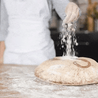

<h1><b>
A French Bakery’s Daily Sales in 2021-2022
</b></h1>

&nbsp;

<small>Chee Kay Cheong, Yishan Chen, Jiayi Yang, Yuxin Liu<small>

&nbsp;

&nbsp;

&nbsp;

<h4><b>
Motivation
<b><h4> 

<small>It is 10:05 am in the morning, you sit in the lecture hall having your earliest lecture of the day Data Science, empty-stomached. A cup of coffee and a nicely warmed chocolate croissant or as French says ‘Pain Au Chocolat’ is the only thing existing in your mind… You wonder why the bakery items are so good and what you can do with it accompanied with the ongoing endless talking of data science explained by your energetic professor… Well, you jumped online and searched datasets for a French bakery and here it happens… 
&nbsp;

Bread is so much a part of French culture that even the word for “friend” comes from Latin cum pane (with bread) meaning the person with whom you break bread. These everyday bakery items can still be something of a mystery to people like you and me (I mean, who doesn’t like carbs?) 
&nbsp;

In this journey, we will take you around the analysis of a typical French bakery and find out what’s the best-seller, how much they sell, how is the sale distributed and so much more… <small>

&nbsp;

&nbsp;

<h4><b>
Why this project?
<b><h4> 

<small>As economics smoothly recover after the COVID-19 outbreak worldwide, competing forces of different retail stores grow as people return back to their normal lives. Since the demand of customers becomes volatile, we would like to use data analysis to help this French bakery identify the KPIs, boost the revenue, and expand the size of the bakery. Specifically, we would like to help the store owner to break down the specifics of how to accomplish their goals by analyzing factors influencing revenues via statistical models and hypotheses, predicting future sales via time-series forecast analyses, and looking at the top 10 popular bread out of all products.<small>

&nbsp;

